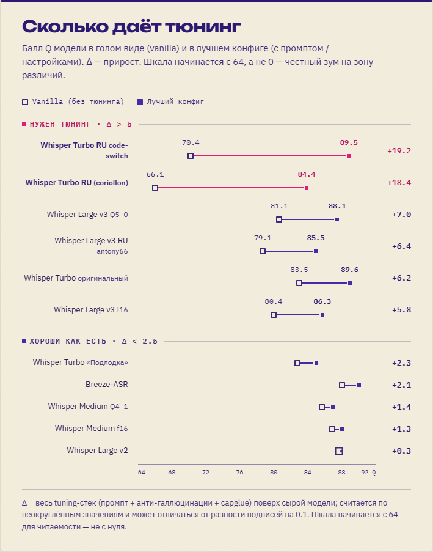

<p align="center">
  
</p>
<p align="center">
  <picture>
    <source media="(prefers-color-scheme: dark)" srcset=".github/assets/wordmark-dark.svg">
    
  </picture>
</p>

> Персональный форк [cjpais/Handy](https://github.com/cjpais/Handy), настроенный под русскую транскрипцию.
> Неподписанные установщики лежат в [Releases](https://github.com/egsok/klava-nevinovata/releases).
> [English](README.md) · [Русский]

`klava-nevinovata` — моя рабочая версия Handy, десктопного приложения для локального распознавания речи. Форк держится близко к upstream, но исправляет проблемы с качеством распознавания и надёжностью, которые я ловлю в повседневной русской диктовке под Windows.

Текущий релиз форка: `0.9.5-1`, база — upstream `v0.9.5`.

## Чем отличается от upstream

### Качество распознавания

Все изменения в этом разделе напрямую улучшают результат распознавания и исправляют типичные ошибки моделей.

- **Меньше галлюцинаций Whisper.** Тишина и неразборчивая речь гораздо реже превращаются в повторы или субтитровые фразы вроде «Продолжение следует...». Декодер переносит не больше 128 токенов предыдущего контекста, схлопывает серии одинаковых предложений и удаляет известные галлюцинации только при полном совпадении. Настоящая речь с теми же словами сохраняется.
- **Custom transcription prompt улучшает распознавание в Whisper и задаёт стиль пунктуации.** Prompt помогает моделям Whisper распознавать имена и специальные термины, улучшает пунктуацию и позволяет указать, как её расставлять. На Whisper Turbo эффект особенно заметен: без prompt русская диктовка часто превращается в сплошной текст почти без знаков препинания. Русский prompt по умолчанию устраняет эту проблему, а в Settings → Advanced его можно настроить под себя.
- **Пунктуация не разваливается в длинных диктовках.** `condition_on_prev_tokens=true` сохраняет контекст между 30-секундными окнами whisper.cpp. Поэтому после первого окна модель продолжает видеть структуру предыдущего текста.
- **Читаемый кириллический текст из Breeze ASR.** Детерминированный post-process возвращает пробелы между кириллическими и смешанными Cyrillic/Latin словами, которые Breeze иногда склеивает, и сохраняет сокращения вроде `.NET` и `PDF`.

#### Проверено на бенчмарке

[Бенчмарк русской IT-речи](https://egorsokolov.ru/ai/whisper-asr-benchmark-russian-it/) сравнивает модели без доработок с их лучшими настроенными конфигурациями. На тестовом корпусе исходный Whisper Turbo вырос с `83,5` до `89,6` Q (`+6,2`), а более слабые варианты Turbo RU прибавили до `+19,2`. График показывает эффект всего tuning-стека: prompt, защиты от галлюцинаций и capglue. Изолированный вклад одного prompt в этом сравнении не измерялся. В статье есть полная методология и все результаты.

[](https://egorsokolov.ru/ai/whisper-asr-benchmark-russian-it/)

### Надёжность и удобство

- **Сохранение всех форматов буфера в стандартном сценарии вставки.** После вставки транскрипта возвращаются файлы, изображения, HTML и текст. Upstream PR [#1231](https://github.com/cjpais/Handy/pull/1231) улучшил legacy-path, но там по-прежнему сохраняется только текст или изображение; поэтому расширенная реализация форка остаётся. Новый экспериментальный reliable-paste из upstream тоже сохранён.
- **Защита от зависания буфера обмена.** Медленный или приостановленный владелец clipboard больше не может надолго заблокировать главный поток. Если снимок не уложился в таймаут, транскрипт всё равно вставится, а недоступный старый буфер не будет принят за намеренно пустой.
- **Watchdog хоткеев и высокий приоритет Windows-hook.** Форк считает ресинхронизации модификаторов, следит за зависаниями пайплайна хоткеев и запускает low-level keyboard hook с time-critical приоритетом. Официальный `handy-keys` 0.3.3 уже сверяет живое состояние модификаторов; форк `handy-keys` добавляет диагностику и повышенный приоритет потока.
- **Атомарные обновления настроек.** Read-modify-write операции сериализованы, поэтому параллельные изменения не могут молча сбросить настройки, например срок хранения истории.

### Визуальный язык

- **Дизайн в две краски.** Интерфейс использует язык «печатной мастерской» канала [«Нейросеть не виновата»](https://t.me/neiroset_ne_vinovata): magenta и глубокий фиолет на крафт-бумаге в светлой теме, чернильная стена в тёмной, IBM Plex и соответствующий оверлей записи. Информационная архитектура upstream не менялась.

## Загрузка

Готовые неподписанные установщики публикуются в [Releases](https://github.com/egsok/klava-nevinovata/releases). Там же остаётся предыдущая стабильная линия `0.8.3-N` — как запасной вариант.

- **Windows:** скачай `klava-nevinovata_0.9.5-1_x64-setup.exe` (NSIS) или `.msi`. Если SmartScreen покажет «Windows protected your PC», выбери **More info → Run anyway**.
- **Linux:** скачай `.deb`, `.AppImage` или `.rpm` под свой дистрибутив.
- **macOS:** используй `aarch64.dmg` для Apple Silicon или `x64.dmg` для Intel Mac, затем перетащи `klava-nevinovata.app` в `/Applications`.

Поскольку сборка для macOS не подписана, при первом запуске система может ошибочно написать, что приложение повреждено. Удали quarantine-атрибут в Терминале:

```bash
xattr -d com.apple.quarantine /Applications/klava-nevinovata.app
```

Если потребуется, используй `sudo xattr -cr /Applications/klava-nevinovata.app`. Приложению также нужны разрешения на микрофон и Универсальный доступ в **Настройки системы → Конфиденциальность и безопасность**. Если Универсальный доступ не выдаётся — смотри [Решение проблем](#решение-проблем).

## Решение проблем

**macOS: галочка «Универсальный доступ» не сохраняется / приложение снова и снова просит доступ.** macOS привязывает это разрешение к «личности» приложения, и устаревшая запись — от оригинального Handy или от старой версии этого приложения — блокирует новую. Что делать:

1. Открой **Системные настройки → Конфиденциальность и безопасность → Универсальный доступ** и удали записи Handy / klava-nevinovata кнопкой **−**.
2. Если оригинальный Handy (или старая версия этого приложения) всё ещё лежит в `/Applications` и ты им не пользуешься — удали его.
3. Сбрось сохранённое разрешение в Терминале (кнопка «Сбросить разрешение» на экране онбординга выполняет первую команду за тебя):

   ```bash
   tccutil reset Accessibility ru.egorsokolov.klava-nevinovata
   ```

   Если когда-то стоял оригинальный Handy или любой более ранний релиз klava-nevinovata (они использовали старый идентификатор) — дополнительно выполни `tccutil reset Accessibility com.pais.handy` (учти: это сбросит разрешение и у оригинального Handy, если ты им пользуешься).

4. Перезапусти приложение и выдай разрешение заново.

**macOS: после обновления приложение снова просит разрешения.** Пока это ожидаемо: сборки не подписаны сертификатом Apple Developer, и каждый обновлённый бинарник macOS считает новым приложением. Выдай разрешение заново и работай дальше.

## Сборка

Платформенные зависимости и детали упаковки описаны в [BUILD.md](BUILD.md). Короткий вариант:

```bash
bun install
bun run tauri build
```

Если на Windows MSVC не хватает памяти при компиляции сгенерированных шейдеров, повтори сборку с `CARGO_BUILD_JOBS=8`. Короткий нестандартный `CARGO_TARGET_DIR` по умолчанию больше не нужен.

## Upstream

Форк отслеживает [cjpais/Handy](https://github.com/cjpais/Handy). Общие инструкции, управление моделями, troubleshooting, платформенные заметки и CLI-флаги смотри в [upstream README](https://github.com/cjpais/Handy/blob/main/README.md).

Если нужен официальный поддерживаемый Handy — используй [handy.computer](https://handy.computer) или [релизы upstream](https://github.com/cjpais/Handy/releases).

## Автор

Сделал [Егор Соколов](https://egorsokolov.ru/). О практической работе с AI-инструментами пишу в Telegram-канале [«Нейросеть не виновата»](https://t.me/neiroset_ne_vinovata).

Другие открытые эксперименты:

- [plan-tango](https://github.com/egsok/plan-tango) — Claude ↔ Codex ревью-цикл для планов.
- [press-1](https://github.com/egsok/press-1) — отвечать на permission-промпты Claude Code одной клавишей из любого окна.
- [napotom](https://github.com/egsok/napotom) — десктопный загрузчик видео и дружелюбная оболочка над yt-dlp.

## Лицензия

MIT, наследуется от cjpais/Handy — см. [LICENSE](LICENSE). Исходная работа © cjpais и контрибьюторы. Правки форка © 2026 Егор Соколов.
